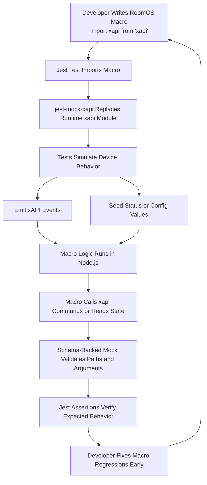

# Jest Mock xAPI

Run Cisco RoomOS JavaScript macro tests in Node.js while preserving the normal `import xapi from "xapi"` developer experience.

This project provides a Jest-compatible mock of the RoomOS `xapi` module so JavaScript macros for Cisco RoomOS devices can be tested locally in a standard Node environment. It exists so macro developers can validate macro behavior without having to deploy to a device for every change or lose the familiar RoomOS import pattern in their source files. It is intended for developers building and maintaining Cisco RoomOS macros who want repeatable automated tests around xAPI commands, status reads, configuration changes, and emitted events.


## Overview

The package exposes a mocked `xapi` module that mirrors the top-level `Command`, `Status`, `Config`, and `Event` areas that RoomOS macro developers already use. Internally, it uses a schema-backed proxy so only valid xAPI paths are available, and each path resolves to a Jest mock function that can be inspected with normal Jest matchers. Commands resolve as promises so command handlers look like the real RoomOS async API, while status, configuration, and event paths support setting values, subscribing to changes, and emitting updates from tests. In practice, a macro test imports the macro, uses the mock xAPI to seed state or emit events, and then asserts that the macro called the expected xAPI command or updated the expected path in response.


### Flow Diagram



This validation flow lets a developer keep their macro source code close to the real RoomOS environment while still getting fast, repeatable feedback locally. Instead of deploying every change to a device, they can exercise macro behavior in Jest, simulate xAPI inputs, and confirm the macro issued the expected commands before shipping.


## Setup

### Prerequisites & Dependencies: 

- Node.js 20 or later is recommended for local development and testing.
- A Jest-based test setup is expected in the macro project that consumes this package.
- The macro under test should import `xapi` exactly as it would on a Cisco RoomOS device: `import xapi from "xapi";`.
- This package is intended for local macro testing and assumes the macro developer is comfortable writing JavaScript or TypeScript unit tests with Jest.


<!-- GETTING STARTED -->

### Installation Steps:
1.  Install `jest-mock-xapi` and Jest in your macro project.
    ```sh
    npm install --save-dev jest jest-mock-xapi
    ```
2.  Create a Jest setup file that maps the runtime `xapi` import to the mock package.
    ```js
    import xapi from "jest-mock-xapi";
    import { jest } from "@jest/globals";

    jest.mock("xapi", () => {
      return {
        __esModule: true,
        default: xapi,
      };
    }, { virtual: true });
    ```
3.  Register that setup file in your Jest configuration so it runs before your macro tests.
    ```json
    {
      "jest": {
        "setupFiles": ["<rootDir>/jest.setup.js"]
      }
    }
    ```
4.  Write tests that import your macro, set xAPI values or emit xAPI changes, and then assert the macro responded correctly.
    ```js
    import { beforeEach, describe, expect, it, jest } from "@jest/globals";

    describe("my roomos macro", () => {
      beforeEach(() => {
        jest.resetModules();
      });

      it("dials when a panel event is triggered", async () => {
        const { default: xapi } = await import("xapi");
        jest.clearAllMocks();
        xapi.removeAllListeners();

        await import("./my-macro.js");

        xapi.Event.UserInterface.Extensions.Panel.Clicked.emit({
          PanelId: "speed-dial-panel",
        });

        expect(xapi.Command.Dial).toHaveBeenCalledWith({
          Number: "number@example.com",
        });
      });
    });
    ```
5.  Run the tests from your macro project.
    ```sh
    npx jest --runInBand
    ```
    
## Demo

The expected development flow is that a macro developer installs `jest-mock-xapi`, keeps their production macro code written for the native RoomOS runtime, and uses Jest to control the mock device state from tests. Tests can call `xapi.Status...set(...)` or `xapi.Config...set(...)` to simulate device state changes, use `xapi.Event...emit(...)` to trigger the same events a RoomOS device would emit, and then validate that the macro reacted by calling the required command path such as `xapi.Command.UserInterface.Extensions.Panel.Save(...)` or `xapi.Command.Dial(...)`.

For read-based behavior, tests can seed values before importing the macro or before invoking the macro logic, then assert that the macro issued the correct follow-up action. For change-driven behavior, tests should register the macro, emit a status, config, or event update through the mock xAPI object, and verify the macro made the required response with normal Jest assertions like `toHaveBeenCalledWith(...)`, `toHaveBeenCalledTimes(...)`, or `not.toHaveBeenCalled()`.

*For more demos & PoCs like this, check out our [Webex Labs site](https://collabtoolbox.cisco.com/webex-labs).


## License

All contents are licensed under the MIT license. Please see [license](LICENSE) for details.


## Disclaimer

Everything included is for demo and Proof of Concept purposes only. Use of the site is solely at your own risk. This site may contain links to third party content, which we do not warrant, endorse, or assume liability for. These demos are for Cisco Webex usecases, but are not Official Cisco Webex Branded demos.


## Questions
Please contact the WXSD team at [wxsd@external.cisco.com](mailto:wxsd@external.cisco.com?subject=jest-mock-xapi) for questions. Or, if you're a Cisco internal employee, reach out to us on the Webex App via our bot (globalexpert@webex.bot). In the "Engagement Type" field, choose the "API/SDK Proof of Concept Integration Development" option to make sure you reach our team. 
